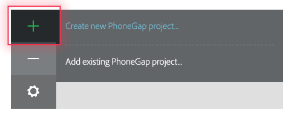
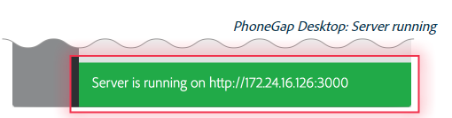
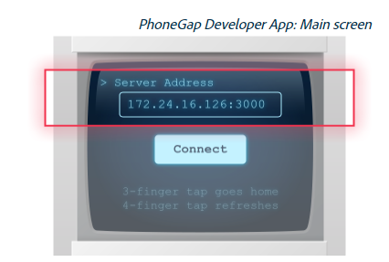

##使用PhoneGap/Cordova需要安装安卓环境用于打包，调试。
---
####安卓环境的安装
1.官网下载安装相应版本的JDK，最新版本java10的下载地址：http://www.oracle.com/technetwork/java/javase/downloads/jdk10-downloads-4416644.html
2.安装完成后配置环境变量，配置后方可使用
环境变量配置方法：https://www.cnblogs.com/smyhvae/p/3788534.html
3.官网下载Android Studio,按照步骤安装SDK和Gradle,下载地址：
http://www.android-studio.org/

####PhoneGap/Cordova安装可使用Node npm也可使用官网exe安装包

- **[PhoneGap](http://docs.phonegap.com)**
    ```
    npm install -g phonegap
    ```
    exe安装包：https://phonegap.com/getstarted/
    安装完成后会有一个可执行exe文件，打开后的页面可以创建app，运行app，调试时手机上需要安装一个移动端的app作为调试环境，输入url即可同步web效果进行调试。
    
    
    

- **[Cordova](http://cordova.axuer.com/)**
    ```
    npm install -g cordova //全局安装
    cordova create MyApp  //创建应用
    cd MyApp  //进入app目录
    cordova platform add browser/android/ios  //添加相应的平台
    cordova plugin add cordova-plugin-camera  //添加插件
    cordova run browser/android/ios   //真机运行
    cordova build browser/android/ios //打包app
    ```
    web文件存放的目录：`MyApp\www\`
    打包后的apk目录：`MyApp\platforms\android\build\outputs\apk\***.apk`