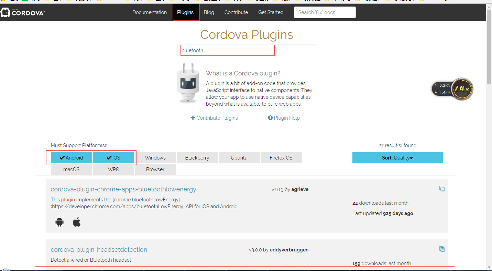
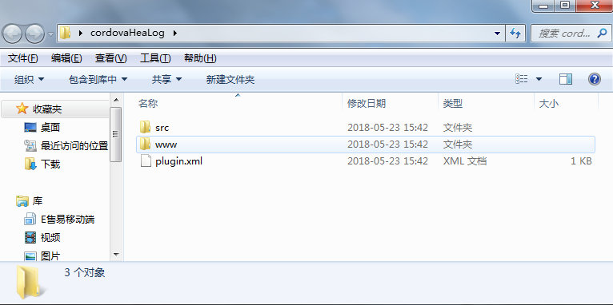

## 插件开发

#### 1.插件的使用

>phonegap/cordova经常会用到各种各样的插件，如获取设备信息，调用摄像头，相册，扫码，蓝牙等等，有的插件cordova插件市场已经提供，只需要安装就好。这些插件的使用流程。

- 1.先到官网插件中心关键字搜索，然后挑选相应的插件

- 2.已初始化的项目安装插件
 `cordova plugin add 插件名称`
  插件相关的命令：
  ```
   cordova plugin list   //列出所有的插件
   cordova plugin remove 插件名称  //移除插件
  ```


#### 2.插件的开发
>遇到不能满足需求的时候就需要自己写插件，完成相应的功能。
>插件开发可参考 [https://github.com/Xonlystar/cordova-plugin-posn5](https://github.com/Xonlystar/cordova-plugin-posn5)这个项目是调用pos s1000打印的一个插件。

插件开发步骤如下：
- 1.安装plugman
    ```
    npm install -g plugman
    ```
- 2.creat一个插件项目
    ```
    //plugman creat --name 插件名字 --plugin_id 插件id --plugin_version 插件版本号
    plugman create --name cordovaHeaLog --plugin_id cordova-plugin-hea-log --plugin_version 1.0
    ```
    命令执行后生成的目录如下：
    
    `src目录对应安卓平台下的src Java代码目录`
    `www目录是js调用方法的声明`
- 3.添加安卓平台支持
    ```
    plugman platform add --platform_name android
    ```
- 4.编码实现功能
    ```
     主要写java代码实现安卓各个功能。
    ```
- 5.项目应用插件
    ```
    cordova plugin add E:\cordovaHeaLog
    ```
[首页](./)
[返回](./安装环境)